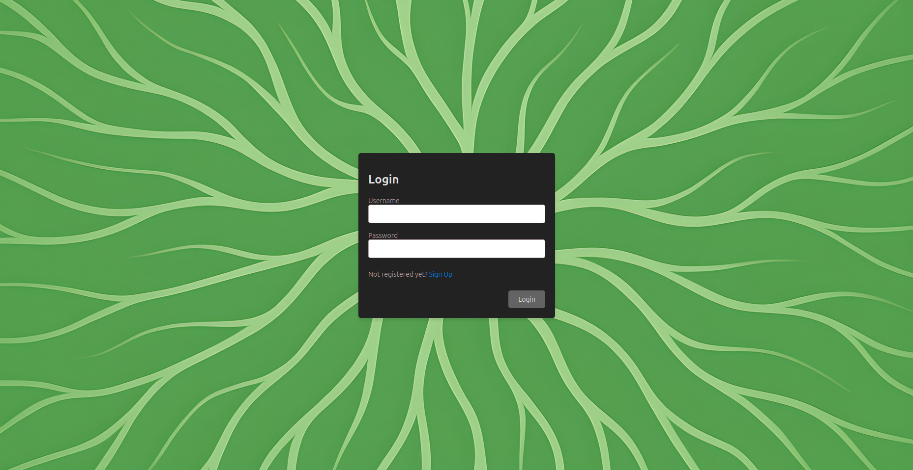

# Trailmenu

This is An Angular Frontend for the Trailmenu Backend. Purpose of this
application is to plan meals for multi day remote hiking trips.

## Table of Contents

- [Node](#node)
- [Angular](#angular)
- [Development Server](#development-server)
- [CI Pipeline](#ci-pipeline)
- [Deployment](#deployment)
- [Production Server](#production)

### Node

To run the frontend node must be installed. We recommend to use `nvm` for
managing different versions of node in different repos. The node version is
defined in the `package.json`

### Angular

Angular is the frontend framework for this project. It is recommended to use VS
Code for development and to install the in `/.vscode/extensions.json`
recommended extensions for the IDE.

### Development server

Run `ng serve` for a dev server. Navigate to `http://localhost:4200/`. The
application will automatically reload if you change any of the source files.

### CI Pipeline

In the CI pipeline code formatting, Linter compliance and test coverage are
enforced. Code that does not pass the CI pipeline cannot be merged into the main
branch.

### Deployment

This app is deployed directly from the GitHub main branch and is rolled out
immediately. You can visit it at [app.pbrenk.com](https://app.pbrenk.com)

### Production

Everyone is welcome to use the app but must first be approved by me to avoid
malicious access. You can go to the register page and register with a username
and password. If by the username I will see that your use case is justified I
will approve you. For example if your username is
`recruiterAtACompanyIJustAppliedTo` I will approve. If it is `hacker123` I will
likely not approve.
